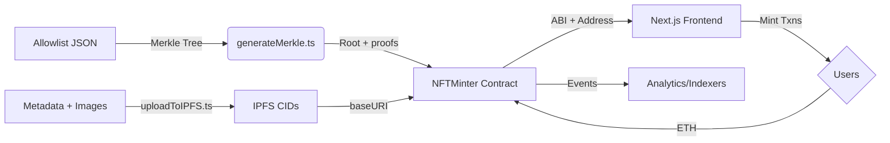

## System Architecture

### Smart Contract Layers
- **Core ERC-721** implemented in `NFTMinter.sol` with custom errors for tight gas usage.
- **Sale Management** toggles for allowlist and public rounds plus wallet mint accounting.
- **Reveal Module** holds hidden URI on-chain and exposes `reveal` to flip to final `baseURI`.
- **Treasury Controls** `withdraw` gated by `onlyOwner` with non-reentrancy guard.

### Frontend Interaction Model
- Next.js App Router page uses Wagmi v2 + viem to read supply, mint price, and sale state from the contract.
- Users trigger `allowlistMint` or `publicMint` with typed hooks that automatically attach the right calldata + ETH.
- Toast notifications reflect optimistic status; mint cards display live mint counts sourced from contract reads.

